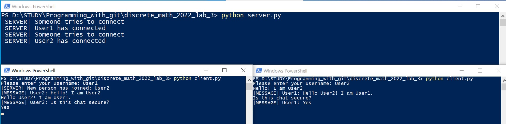
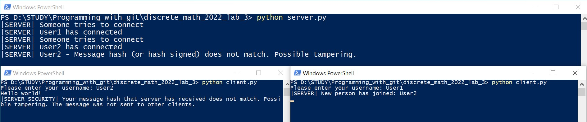

# Discrete math 2022 laboratory work 3. Cryptography 

The task of laboratory work is to make the transmission of messages on the provided implementation of the terminal chat program secure.

## How the task was solved
The following elements were implemented for this purpose:
 - RSA algorithm
 - Exchange of public RSA keys between user and server
 - Encryption and decryption of the messages using the RSA algorithm;
 - The use of the SHAKE-256 hash for the calculation of the hash of the messages and verification of integrity of the messages;
 - The signing of hash values using the RSA algorithm (Digital Signature) to prove the authenticity of the message;
 - Console user interface for the chat program displaying messages and errors (such as NetworkSecurityError, etc.)

## Usage example

The chat is secured by the RSA encryption, digital signature and SHAKE-256 hash.

**Tampering attempts have been made to the chat.**  
**They have been detected and reported.**

## Author
[Serhii Matsyshyn](https://github.com/serhii-matsyshyn)
